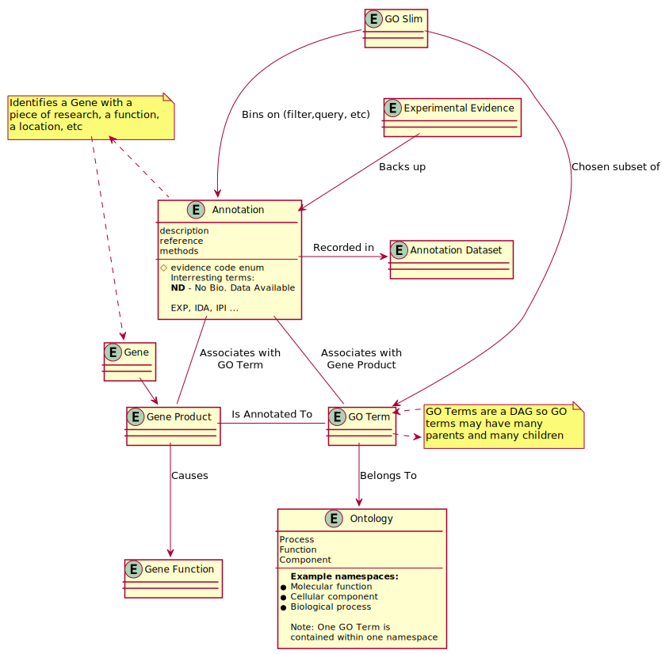

# Week 3 Project Report (2019-09-09)

## Establishing a Development Process

Our team has decided to work using the Scrum development methodology. The
key actors in the Scrum process are:

* Product Owner (Joseph Shearer)
* Scrum Master (Nick Mosher)
* Development Team (Everybody)

The Product Owner is the person in charge of communicating with the customer,
writing user stories, and prioritizing the user stories in the Product Backlog
according to the needs of the customer. The Scrum Master is in charge of
monitoring the workflow and efforts of the team and ensuring that members of
the Development Team can overcome any obstacles they encounter. The
Development Team is in charge of working on user stories and holds a short
"standup" meeting in which each member gives a short update about their
progress and potential blockers.

### Methodology

The Scrum Methodology works in a cycle during which a handful of important
events take place. These events, in order, are:

* Requirements Elicitation
* Backlog Grooming
* Sprint Planning
* Sprint
* Demonstration to Customer
* Sprint Retrospective

Requirements Elicitation is led by the Product Owner and happens during
meetings with the customer, the senior project sponsor. During this step,
the product owner and/or members of the development team will write out
rough drafts of user stories with the general outline of tasks that need
done. These user stories are added to the product backlog and prioritized
by the product owner in conjunction with the customer.

The Backlog Grooming step is a meeting that involves the development team.
For each user story in the product backlog, members of the development team
discuss the work that needs to be done and clearly define the acceptance
criteria of the stories. This "grooming" is done in priority order of the
stories in the product backlog, and continues until enough stories to fill
at least one sprint have been groomed.

The Sprint Planning is the last step that takes place before the sprint itself
begins. At this meeting, the development team looks at each story in the
product backlog and assigns them a Point rating that describes the relative
effort that the story entails. Story Points are typically given by the first
few numbers in the Fibonacci sequence to represent the non-linear perception
of the increase in task difficulty. Generally speaking:

* 1 point means that one member can finish the task in less than a day
* 2 points means that one member can finish the task in a whole day
* 3 points means that one member can finish the task in two to three days
* 5 points means that one member can finish the task in a week
* 8 points means that one member can finish the task in a 2-week sprint
* 13 points means that the story needs to be broken into smaller stories

The development team rates stories one at a time by counting down and voting
all at once by a show of hands in order to prevent anchor bias. Each member
holds up fingers to show how many points a story should have, with 10 fingers
being used to represent a 13. If the votes are note unanimous, then the team
holds a discussion as to why they think the task should be worth more or less
points. This dicussion continues until a unanimous point rating is found.

After all of the user stories have been "pointed", the development team
decides how many stories to move from the product backlog into the sprint
backlog. This is done in priority order, and is based on how many total
story points are present on the user stories in the sprint backlog. As a
baseline, there should be approximately 8-10 story points per member of the
development team. This total count of points achieved per sprint is known as
the team's "velocity", and may increase or decrease over time.

The sprint itself is typically a one to two week period of time during which
the development team works on fulfilling user stories. Typically each day,
the team shares a progress update about what work has been accomplished,
what is currently being worked on, and what obstacles have appeared. For the
case of our senior project, we'll share progress updates at each team meeting,
which happen a handful of times per week. We'll also use a sprint cycle period
of one week.

The Customer Demonstration happens at the end of each sprint, and is where
the development team shows the deliverable work that's been accomplished
during the sprint. We'll allocate time during our weekly sponsor meeting to
show the work we've accomplished and get feedback, and the product owner
will use this as an opportunity to elicit new requirements.

Finally, the Sprint Retrospective is a means for the development team to
look at what went well or went poorly during the sprint and build a plan to
improve the process for the next sprint. At the retrospective, we'll call out
especially positive outcomes such as large achievements by a team member, as
well as point out shortcomings that happened during the sprint.

## Preliminary Domain Model

During week 3, our team started working on a first-pass domain model, shown below.

## Timesheet

