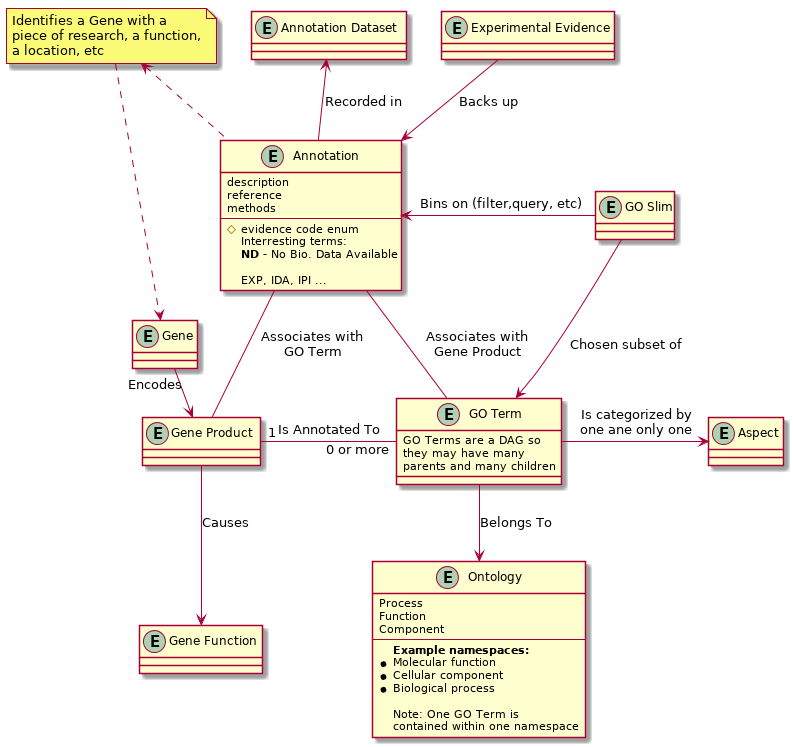
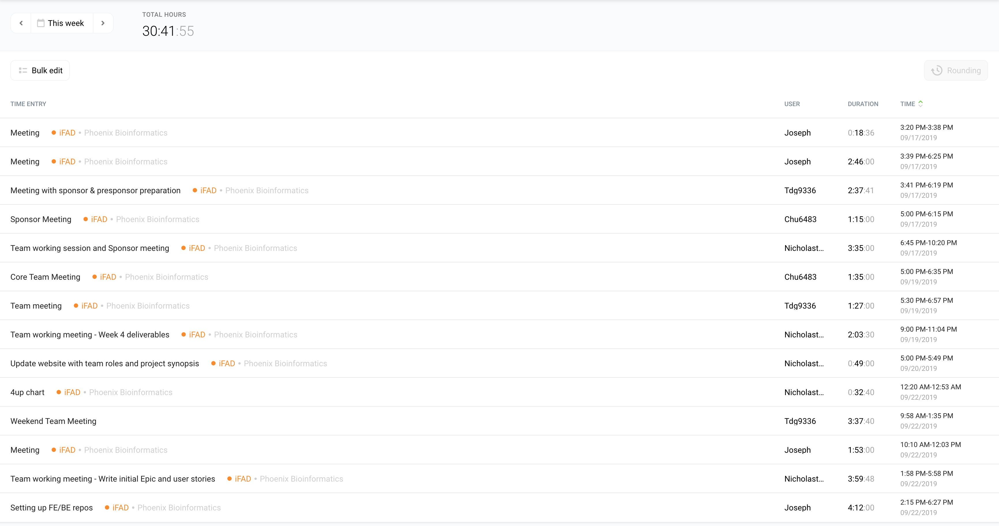

# Week 4 Project Report (2019-09-19)

## Four-Up Status

<table>
  <tr>
    <th>What's been done since the last update?</th>
    <th>What's currently in progress?</th>
  </tr>
  <tr>
    <td>
      <ul>
        <li>Nick Mosher</li>
        <ul>
          <li>Updated the project website with week 3 updates.</li>
          <li>Wrote up the team process methodology.</li>
        </ul>
        <li>Joseph Shearer</li>
        <ul>
          <li></li>
        </ul>
        <li>Chike Udenze</li>
        <ul>
          <li></li>
        </ul>
        <li>Tim Geary</li>
        <ul>
          <li></li>
        </ul>
      </ul>
    </td>
    <td>
      <ul>
        <li>Nick Mosher</li>
        <ul>
          <li>Writing the week 4 project updates.</li>
        </ul>
        <li>Joseph Shearer</li>
        <ul>
          <li></li>
        </ul>
        <li>Chike Udenze</li>
        <ul>
          <li></li>
        </ul>
        <li>Tim Geary</li>
        <ul>
          <li></li>
        </ul>
      </ul>
    </td>
  </tr>
  <tr>
    <th>What do we need to accomplish our goals?</th>
    <th>What are some risks we're facing?</th>
  </tr>
  <tr>
    <td>
      <ul>
        <li>
          Github repositories for the frontend and backend to be
          provisioned.
        </li>
        <li>
          Cloud resources for deploying our solution. AWS has been
          mentioned, is that being provided by the sponsor or will
          we be expected to pay forthe resources out of pocket?
        </li>
      </ul>
    </td>
    <td>
      <ul>
        <li>
          The desired data visualization strategy is not strongly
          defined. It seems we have some flexibility to "figure out
          what will be useful", but there's a risk that since we're
          not true domain experts we may have trouble identifying
          a visualization technique that's actually useful.
        </li>
        <li>
          This project seems like it is dealing with a sizeable
          dataset, yet we've been constrained to using
          Javascript/Typescript for the backend, languages which are
          known not to have great performance characteristics. We
          may experience latency in our application if the backend is
          not able to process queries fast enough.
        </li>
      </ul>
    </td>
  </tr>
</table>

## Project Synopsis

The team at Phoenix Bioinformatics provides services for the scientific
community by providing a curated dataset of information about the
Arabidopsis Thaliana genome. In order to provide these services, Phoenix
has built up a dataset of curated genetic information, the most atomic
unit of which is the annotation. At a high level, annotations link
specific genes to specific ontological terms. Ontological terms (from
here on referred to as GO terms, or Gene Ontology terms) are the tool
through which all genes (through annotations) are identified to either
the location within the cell, a specific molecular function, or a specific biological process.

With all of this raw information being curated and updated every week,
Phoenix needs to be able to expose it all to researchers in a way that
supports querying for and analyzing relevant information. At a high level,
all of this boils down to the ability to query for annotations (and through
them, gene products and genes) that match some potentially complex filter
(slim the Ontology to a much smaller subset of relevant terms, bin by
specific GO terms, pick preset slim and additional bins, filter by specific
evidence codes and/or method, etc). With this capability, researchers will
be able to perform both of the core tasks identified above: find research
relevant to their area of research (by filtering for relevant GO terms),
and identifying understudied areas of the genome by filtering by evidence
code *ND*, for no data available.

## Metrics and Measurements

*Story Points*: We are utilizing a scrum based points methodology to keep
track of work done. Each task is assigned a point value by the team and
these points are kept track of as related to the team member working on
the task. These details will give substantial insight into team contribution.

*Requirements Volatility*: Acceptance criteria changes elicit changes in
requirements. We intend on keeping track of changing requirements before,
during and after sprints. This metric will be represented as a percentage
of the total sprint requirements that were changed come the end of the
sprint. We believe this metric is important as it provides significant
weekly insight into the status of sprint deliverables as well as feedback
to improve the team’s definition of user stories.

## Updated Domain Model

After feedback and clarification from the sponsor, we've made some changes
to the domain model.

## Timesheet

